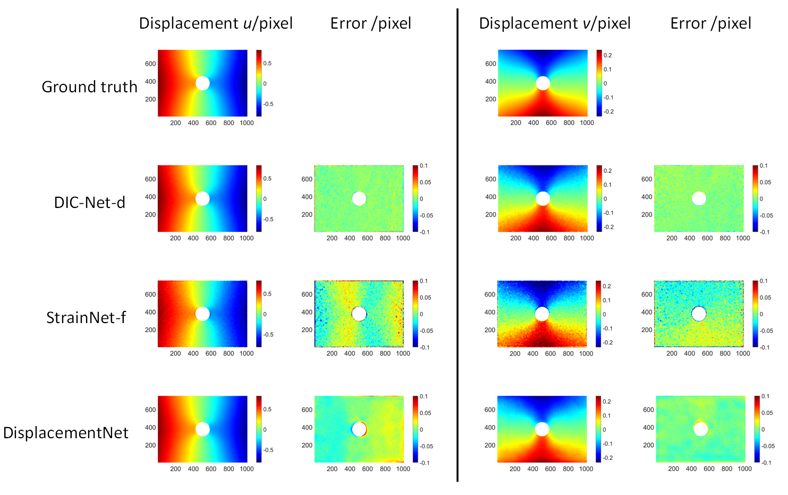

# DIC-Net: Upgrade the Performance of Traditional DIC with Hermite Dataset and Convolution Neural Network
Hermite dataset generation implementation (matlab) and DIC-Net CNN implementation (pytorch).

## Introduction
Our method is currently the SOTA of 2D-DeepDIC method in terms of accuracy and spatial resolution(SR). 

In the experimental test set with 3216 samples, DIC-Net-d achieves an absolute pixel error (MAE) score of 0.0130 pixels and 0.0126 pixels in the x direction and y direction which is only 48.5% and 47.9% of the prior best method. The spatial resolution (SR) is 17.25 pixels with a noise level of 0.0136, and the metrological performance indicator is 0.234 (lower is better) which outperforms existing traditional and non-traditional methods.

For more details, please refer to our paper: https://doi.org/10.1016/j.optlaseng.2022.107278

* **Frame of DIC-Net**

* **Frame of Hermite Dataset**

## Main Results
* **Prediction error statistics of three networks on 3216 samples**
<table class="MsoNormalTable" border="0" cellspacing="0" cellpadding="0" width="100%" style="width:100.0%;border-collapse:collapse;mso-yfti-tbllook:1184;mso-padding-alt:
 0cm 5.4pt 0cm 5.4pt">
 <tbody><tr style="mso-yfti-irow:0;mso-yfti-firstrow:yes;height:13.5pt">
  <td width="37%" nowrap="" rowspan="2" style="width:37.38%;border:solid windowtext 1.0pt;
  border-left:none;padding:0cm 5.4pt 0cm 5.4pt;height:13.5pt">
  
Displacement mode (number
  of samples)<o:p></o:p>

  </td>
  <td width="21%" nowrap="" rowspan="2" style="width:21.34%;border:solid windowtext 1.0pt;
  border-left:none;mso-border-left-alt:solid windowtext 1.0pt;padding:0cm 5.4pt 0cm 5.4pt;
  height:13.5pt">
  
Network<o:p></o:p>

  </td>
  <td width="20%" nowrap="" colspan="2" style="width:20.62%;border:solid windowtext 1.0pt;
  border-left:none;mso-border-left-alt:solid windowtext 1.0pt;padding:0cm 5.4pt 0cm 5.4pt;
  height:13.5pt">
  
Average MAE/pixel<o:p></o:p>

  </td>
  <td width="20%" nowrap="" colspan="2" style="width:20.66%;border-top:solid windowtext 1.0pt;
  border-left:none;border-bottom:solid windowtext 1.0pt;border-right:none;
  mso-border-left-alt:solid windowtext 1.0pt;padding:0cm 5.4pt 0cm 5.4pt;
  height:13.5pt">
  
Average RMSE/pixel<o:p></o:p>

  </td>
 </tr>
 <tr style="mso-yfti-irow:1;height:13.5pt">
  <td width="10%" nowrap="" style="width:10.3%;border-top:none;border-left:none;
  border-bottom:solid windowtext 1.0pt;border-right:solid windowtext 1.0pt;
  mso-border-top-alt:solid windowtext 1.0pt;mso-border-left-alt:solid windowtext 1.0pt;
  padding:0cm 5.4pt 0cm 5.4pt;height:13.5pt">
  
u<o:p></o:p>

  </td>
  <td width="10%" nowrap="" style="width:10.32%;border:solid windowtext 1.0pt;
  border-left:none;mso-border-left-alt:solid windowtext 1.0pt;padding:0cm 5.4pt 0cm 5.4pt;
  height:13.5pt">
  
v<o:p></o:p>

  </td>
  <td width="10%" nowrap="" style="width:10.32%;border-top:none;border-left:none;
  border-bottom:solid windowtext 1.0pt;border-right:solid windowtext 1.0pt;
  mso-border-top-alt:solid windowtext 1.0pt;mso-border-left-alt:solid windowtext 1.0pt;
  padding:0cm 5.4pt 0cm 5.4pt;height:13.5pt">
  
u<o:p></o:p>

  </td>
  <td width="10%" nowrap="" style="width:10.34%;border:none;border-bottom:solid windowtext 1.0pt;
  mso-border-top-alt:solid windowtext 1.0pt;mso-border-left-alt:solid windowtext 1.0pt;
  padding:0cm 5.4pt 0cm 5.4pt;height:13.5pt">
  
v<o:p></o:p>

  </td>
 </tr>
 <tr style="mso-yfti-irow:2;height:13.5pt">
  <td width="37%" nowrap="" rowspan="3" style="width:37.38%;border:none;border-right:
  solid windowtext 1.0pt;mso-border-top-alt:solid windowtext 1.0pt;padding:
  0cm 5.4pt 0cm 5.4pt;height:13.5pt">
  
Pure
  translations
  (785)<o:p></o:p>

  </td>
  <td width="21%" nowrap="" style="width:21.34%;border:none;border-right:solid windowtext 1.0pt;
  mso-border-left-alt:solid windowtext 1.0pt;padding:0cm 5.4pt 0cm 5.4pt;
  height:13.5pt">
  
DIC-Net-d <o:p></o:p>

  </td>
  <td width="10%" nowrap="" style="width:10.3%;border:none;border-right:solid windowtext 1.0pt;
  mso-border-left-alt:solid windowtext 1.0pt;padding:0cm 5.4pt 0cm 5.4pt;
  height:13.5pt">
  
<b>0.0124</b><o:p></o:p>

  </td>
  <td width="10%" nowrap="" style="width:10.32%;border:none;border-right:solid windowtext 1.0pt;
  mso-border-left-alt:solid windowtext 1.0pt;padding:0cm 5.4pt 0cm 5.4pt;
  height:13.5pt">
  
<b>0.0115</b><o:p></o:p>

  </td>
  <td width="10%" nowrap="" style="width:10.32%;border:none;border-right:solid windowtext 1.0pt;
  mso-border-left-alt:solid windowtext 1.0pt;padding:0cm 5.4pt 0cm 5.4pt;
  height:13.5pt">
  
<b>0.0155</b><o:p></o:p>

  </td>
  <td width="10%" nowrap="" style="width:10.34%;border:none;mso-border-left-alt:
  solid windowtext 1.0pt;padding:0cm 5.4pt 0cm 5.4pt;height:13.5pt">
  
<b>0.0147</b><o:p></o:p>

  </td>
 </tr>
 <tr style="mso-yfti-irow:3;height:13.5pt">
  <td width="21%" nowrap="" style="width:21.34%;border:none;border-right:solid windowtext 1.0pt;
  mso-border-left-alt:solid windowtext 1.0pt;padding:0cm 5.4pt 0cm 5.4pt;
  height:13.5pt">
  
DisplacementNet<o:p></o:p>

  </td>
  <td width="10%" nowrap="" style="width:10.3%;border:none;border-right:solid windowtext 1.0pt;
  mso-border-left-alt:solid windowtext 1.0pt;padding:0cm 5.4pt 0cm 5.4pt;
  height:13.5pt">
  
0.0182<b><o:p></o:p></b>

  </td>
  <td width="10%" nowrap="" style="width:10.32%;border:none;border-right:solid windowtext 1.0pt;
  mso-border-left-alt:solid windowtext 1.0pt;padding:0cm 5.4pt 0cm 5.4pt;
  height:13.5pt">
  
0.0154<b><o:p></o:p></b>

  </td>
  <td width="10%" nowrap="" style="width:10.32%;border:none;border-right:solid windowtext 1.0pt;
  mso-border-left-alt:solid windowtext 1.0pt;padding:0cm 5.4pt 0cm 5.4pt;
  height:13.5pt">
  
0.0197<b><o:p></o:p></b>

  </td>
  <td width="10%" nowrap="" style="width:10.34%;border:none;mso-border-left-alt:
  solid windowtext 1.0pt;padding:0cm 5.4pt 0cm 5.4pt;height:13.5pt">
  
0.0172<b><o:p></o:p></b>

  </td>
 </tr>
 <tr style="mso-yfti-irow:4;height:13.5pt">
  <td width="21%" nowrap="" style="width:21.34%;border-top:none;border-left:none;
  border-bottom:solid windowtext 1.0pt;border-right:solid windowtext 1.0pt;
  mso-border-left-alt:solid windowtext 1.0pt;padding:0cm 5.4pt 0cm 5.4pt;
  height:13.5pt">
  
StrainNet-f<o:p></o:p>

  </td>
  <td width="10%" nowrap="" style="width:10.3%;border-top:none;border-left:none;
  border-bottom:solid windowtext 1.0pt;border-right:solid windowtext 1.0pt;
  mso-border-left-alt:solid windowtext 1.0pt;padding:0cm 5.4pt 0cm 5.4pt;
  height:13.5pt">
  
0.0265<o:p></o:p>

  </td>
  <td width="10%" nowrap="" style="width:10.32%;border-top:none;border-left:none;
  border-bottom:solid windowtext 1.0pt;border-right:solid windowtext 1.0pt;
  mso-border-left-alt:solid windowtext 1.0pt;padding:0cm 5.4pt 0cm 5.4pt;
  height:13.5pt">
  
0.0255<o:p></o:p>

  </td>
  <td width="10%" nowrap="" style="width:10.32%;border-top:none;border-left:none;
  border-bottom:solid windowtext 1.0pt;border-right:solid windowtext 1.0pt;
  mso-border-left-alt:solid windowtext 1.0pt;padding:0cm 5.4pt 0cm 5.4pt;
  height:13.5pt">
  
0.0442<o:p></o:p>

  </td>
  <td width="10%" nowrap="" style="width:10.34%;border:none;border-bottom:solid windowtext 1.0pt;
  mso-border-left-alt:solid windowtext 1.0pt;padding:0cm 5.4pt 0cm 5.4pt;
  height:13.5pt">
  
0.0418<o:p></o:p>

  </td>
 </tr>
 <tr style="mso-yfti-irow:5;height:13.5pt">
  <td width="37%" nowrap="" rowspan="3" style="width:37.38%;border-top:solid windowtext 1.0pt;
  border-left:none;border-bottom:none;border-right:solid windowtext 1.0pt;
  padding:0cm 5.4pt 0cm 5.4pt;height:13.5pt">
  
Gaussian (445)<o:p></o:p>

  </td>
  <td width="21%" nowrap="" style="width:21.34%;border:none;border-right:solid windowtext 1.0pt;
  mso-border-left-alt:solid windowtext 1.0pt;padding:0cm 5.4pt 0cm 5.4pt;
  height:13.5pt">
  
DIC-Net-d<o:p></o:p>

  </td>
  <td width="10%" nowrap="" style="width:10.3%;border:none;border-right:solid windowtext 1.0pt;
  mso-border-left-alt:solid windowtext 1.0pt;padding:0cm 5.4pt 0cm 5.4pt;
  height:13.5pt">
  
<b>0.0128</b><o:p></o:p>

  </td>
  <td width="10%" nowrap="" style="width:10.32%;border:none;border-right:solid windowtext 1.0pt;
  mso-border-left-alt:solid windowtext 1.0pt;padding:0cm 5.4pt 0cm 5.4pt;
  height:13.5pt">
  
<b>0.0122</b><o:p></o:p>

  </td>
  <td width="10%" nowrap="" style="width:10.32%;border:none;border-right:solid windowtext 1.0pt;
  mso-border-left-alt:solid windowtext 1.0pt;padding:0cm 5.4pt 0cm 5.4pt;
  height:13.5pt">
  
<b>0.0161</b><o:p></o:p>

  </td>
  <td width="10%" nowrap="" style="width:10.34%;border:none;mso-border-left-alt:
  solid windowtext 1.0pt;padding:0cm 5.4pt 0cm 5.4pt;height:13.5pt">
  
<b>0.0156</b><o:p></o:p>

  </td>
 </tr>
 <tr style="mso-yfti-irow:6;height:13.5pt">
  <td width="21%" nowrap="" style="width:21.34%;border:none;border-right:solid windowtext 1.0pt;
  mso-border-left-alt:solid windowtext 1.0pt;padding:0cm 5.4pt 0cm 5.4pt;
  height:13.5pt">
  
DisplacementNet<o:p></o:p>

  </td>
  <td width="10%" nowrap="" style="width:10.3%;border:none;border-right:solid windowtext 1.0pt;
  mso-border-left-alt:solid windowtext 1.0pt;padding:0cm 5.4pt 0cm 5.4pt;
  height:13.5pt">
  
0.0171<b><o:p></o:p></b>

  </td>
  <td width="10%" nowrap="" style="width:10.32%;border:none;border-right:solid windowtext 1.0pt;
  mso-border-left-alt:solid windowtext 1.0pt;padding:0cm 5.4pt 0cm 5.4pt;
  height:13.5pt">
  
0.0164<b><o:p></o:p></b>

  </td>
  <td width="10%" nowrap="" style="width:10.32%;border:none;border-right:solid windowtext 1.0pt;
  mso-border-left-alt:solid windowtext 1.0pt;padding:0cm 5.4pt 0cm 5.4pt;
  height:13.5pt">
  
0.0199<b><o:p></o:p></b>

  </td>
  <td width="10%" nowrap="" style="width:10.34%;border:none;mso-border-left-alt:
  solid windowtext 1.0pt;padding:0cm 5.4pt 0cm 5.4pt;height:13.5pt">
  
0.0194<b><o:p></o:p></b>

  </td>
 </tr>
 <tr style="mso-yfti-irow:7;height:13.5pt">
  <td width="21%" nowrap="" style="width:21.34%;border-top:none;border-left:none;
  border-bottom:solid windowtext 1.0pt;border-right:solid windowtext 1.0pt;
  mso-border-left-alt:solid windowtext 1.0pt;padding:0cm 5.4pt 0cm 5.4pt;
  height:13.5pt">
  
StrainNet-f<o:p></o:p>

  </td>
  <td width="10%" nowrap="" style="width:10.3%;border-top:none;border-left:none;
  border-bottom:solid windowtext 1.0pt;border-right:solid windowtext 1.0pt;
  mso-border-left-alt:solid windowtext 1.0pt;padding:0cm 5.4pt 0cm 5.4pt;
  height:13.5pt">
  
0.0256<o:p></o:p>

  </td>
  <td width="10%" nowrap="" style="width:10.32%;border-top:none;border-left:none;
  border-bottom:solid windowtext 1.0pt;border-right:solid windowtext 1.0pt;
  mso-border-left-alt:solid windowtext 1.0pt;padding:0cm 5.4pt 0cm 5.4pt;
  height:13.5pt">
  
0.0265<o:p></o:p>

  </td>
  <td width="10%" nowrap="" style="width:10.32%;border-top:none;border-left:none;
  border-bottom:solid windowtext 1.0pt;border-right:solid windowtext 1.0pt;
  mso-border-left-alt:solid windowtext 1.0pt;padding:0cm 5.4pt 0cm 5.4pt;
  height:13.5pt">
  
0.0441<o:p></o:p>

  </td>
  <td width="10%" nowrap="" style="width:10.34%;border:none;border-bottom:solid windowtext 1.0pt;
  mso-border-left-alt:solid windowtext 1.0pt;padding:0cm 5.4pt 0cm 5.4pt;
  height:13.5pt">
  
0.0433<o:p></o:p>

  </td>
 </tr>
 <tr style="mso-yfti-irow:8;height:13.5pt">
  <td width="37%" nowrap="" rowspan="3" style="width:37.38%;border-top:solid windowtext 1.0pt;
  border-left:none;border-bottom:none;border-right:solid windowtext 1.0pt;
  padding:0cm 5.4pt 0cm 5.4pt;height:13.5pt">
  
Periodic
  displacement
  (497)<o:p></o:p>

  </td>
  <td width="21%" nowrap="" style="width:21.34%;border:none;border-right:solid windowtext 1.0pt;
  mso-border-left-alt:solid windowtext 1.0pt;padding:0cm 5.4pt 0cm 5.4pt;
  height:13.5pt">
  
DIC-Net-d<o:p></o:p>

  </td>
  <td width="10%" nowrap="" style="width:10.3%;border:none;border-right:solid windowtext 1.0pt;
  mso-border-left-alt:solid windowtext 1.0pt;padding:0cm 5.4pt 0cm 5.4pt;
  height:13.5pt">
  
<b style="mso-bidi-font-weight:normal">0.0157</b><o:p></o:p>

  </td>
  <td width="10%" nowrap="" style="width:10.32%;border:none;border-right:solid windowtext 1.0pt;
  mso-border-left-alt:solid windowtext 1.0pt;padding:0cm 5.4pt 0cm 5.4pt;
  height:13.5pt">
  
<b style="mso-bidi-font-weight:normal">0.0169</b><o:p></o:p>

  </td>
  <td width="10%" nowrap="" style="width:10.32%;border:none;border-right:solid windowtext 1.0pt;
  mso-border-left-alt:solid windowtext 1.0pt;padding:0cm 5.4pt 0cm 5.4pt;
  height:13.5pt">
  
<b style="mso-bidi-font-weight:normal">0.0201</b><o:p></o:p>

  </td>
  <td width="10%" nowrap="" style="width:10.34%;border:none;mso-border-left-alt:
  solid windowtext 1.0pt;padding:0cm 5.4pt 0cm 5.4pt;height:13.5pt">
  
<b style="mso-bidi-font-weight:normal">0.0217</b><o:p></o:p>

  </td>
 </tr>
 <tr style="mso-yfti-irow:9;height:13.5pt">
  <td width="21%" nowrap="" style="width:21.34%;border:none;border-right:solid windowtext 1.0pt;
  mso-border-left-alt:solid windowtext 1.0pt;padding:0cm 5.4pt 0cm 5.4pt;
  height:13.5pt">
  
DisplacementNet<o:p></o:p>

  </td>
  <td width="10%" nowrap="" style="width:10.3%;border:none;border-right:solid windowtext 1.0pt;
  mso-border-left-alt:solid windowtext 1.0pt;padding:0cm 5.4pt 0cm 5.4pt;
  height:13.5pt">
  
0.1191<b style="mso-bidi-font-weight:normal"><o:p></o:p></b>

  </td>
  <td width="10%" nowrap="" style="width:10.32%;border:none;border-right:solid windowtext 1.0pt;
  mso-border-left-alt:solid windowtext 1.0pt;padding:0cm 5.4pt 0cm 5.4pt;
  height:13.5pt">
  
0.1539<b style="mso-bidi-font-weight:normal"><o:p></o:p></b>

  </td>
  <td width="10%" nowrap="" style="width:10.32%;border:none;border-right:solid windowtext 1.0pt;
  mso-border-left-alt:solid windowtext 1.0pt;padding:0cm 5.4pt 0cm 5.4pt;
  height:13.5pt">
  
0.1395<b style="mso-bidi-font-weight:normal"><o:p></o:p></b>

  </td>
  <td width="10%" nowrap="" style="width:10.34%;border:none;mso-border-left-alt:
  solid windowtext 1.0pt;padding:0cm 5.4pt 0cm 5.4pt;height:13.5pt">
  
0.1783<b style="mso-bidi-font-weight:normal"><o:p></o:p></b>

  </td>
 </tr>
 <tr style="mso-yfti-irow:10;height:13.5pt">
  <td width="21%" nowrap="" style="width:21.34%;border-top:none;border-left:none;
  border-bottom:solid windowtext 1.0pt;border-right:solid windowtext 1.0pt;
  mso-border-left-alt:solid windowtext 1.0pt;padding:0cm 5.4pt 0cm 5.4pt;
  height:13.5pt">
  
StrainNet-f<o:p></o:p>

  </td>
  <td width="10%" nowrap="" style="width:10.3%;border-top:none;border-left:none;
  border-bottom:solid windowtext 1.0pt;border-right:solid windowtext 1.0pt;
  mso-border-left-alt:solid windowtext 1.0pt;padding:0cm 5.4pt 0cm 5.4pt;
  height:13.5pt">
  
0.0288<o:p></o:p>

  </td>
  <td width="10%" nowrap="" style="width:10.32%;border-top:none;border-left:none;
  border-bottom:solid windowtext 1.0pt;border-right:solid windowtext 1.0pt;
  mso-border-left-alt:solid windowtext 1.0pt;padding:0cm 5.4pt 0cm 5.4pt;
  height:13.5pt">
  
0.0295<o:p></o:p>

  </td>
  <td width="10%" nowrap="" style="width:10.32%;border-top:none;border-left:none;
  border-bottom:solid windowtext 1.0pt;border-right:solid windowtext 1.0pt;
  mso-border-left-alt:solid windowtext 1.0pt;padding:0cm 5.4pt 0cm 5.4pt;
  height:13.5pt">
  
0.0467<o:p></o:p>

  </td>
  <td width="10%" nowrap="" style="width:10.34%;border:none;border-bottom:solid windowtext 1.0pt;
  mso-border-left-alt:solid windowtext 1.0pt;padding:0cm 5.4pt 0cm 5.4pt;
  height:13.5pt">
  
0.0458<o:p></o:p>

  </td>
 </tr>
 <tr style="mso-yfti-irow:11;height:13.5pt">
  <td width="37%" nowrap="" rowspan="3" style="width:37.38%;border-top:solid windowtext 1.0pt;
  border-left:none;border-bottom:none;border-right:solid windowtext 1.0pt;
  padding:0cm 5.4pt 0cm 5.4pt;height:13.5pt">
  
Strain
  concentrations
  (418)<o:p></o:p>

  </td>
  <td width="21%" nowrap="" style="width:21.34%;border:none;border-right:solid windowtext 1.0pt;
  mso-border-left-alt:solid windowtext 1.0pt;padding:0cm 5.4pt 0cm 5.4pt;
  height:13.5pt">
  
DIC-Net-d<o:p></o:p>

  </td>
  <td width="10%" nowrap="" style="width:10.3%;border:none;border-right:solid windowtext 1.0pt;
  mso-border-left-alt:solid windowtext 1.0pt;padding:0cm 5.4pt 0cm 5.4pt;
  height:13.5pt">
  
<b>0.0137</b><o:p></o:p>

  </td>
  <td width="10%" nowrap="" style="width:10.32%;border:none;border-right:solid windowtext 1.0pt;
  mso-border-left-alt:solid windowtext 1.0pt;padding:0cm 5.4pt 0cm 5.4pt;
  height:13.5pt">
  
<b>0.0122</b><o:p></o:p>

  </td>
  <td width="10%" nowrap="" style="width:10.32%;border:none;border-right:solid windowtext 1.0pt;
  mso-border-left-alt:solid windowtext 1.0pt;padding:0cm 5.4pt 0cm 5.4pt;
  height:13.5pt">
  
<b>0.0175</b><o:p></o:p>

  </td>
  <td width="10%" nowrap="" style="width:10.34%;border:none;mso-border-left-alt:
  solid windowtext 1.0pt;padding:0cm 5.4pt 0cm 5.4pt;height:13.5pt">
  
<b>0.0157</b><o:p></o:p>

  </td>
 </tr>
 <tr style="mso-yfti-irow:12;height:13.5pt">
  <td width="21%" nowrap="" style="width:21.34%;border:none;border-right:solid windowtext 1.0pt;
  mso-border-left-alt:solid windowtext 1.0pt;padding:0cm 5.4pt 0cm 5.4pt;
  height:13.5pt">
  
DisplacementNet<o:p></o:p>

  </td>
  <td width="10%" nowrap="" style="width:10.3%;border:none;border-right:solid windowtext 1.0pt;
  mso-border-left-alt:solid windowtext 1.0pt;padding:0cm 5.4pt 0cm 5.4pt;
  height:13.5pt">
  
0.0410<b><o:p></o:p></b>

  </td>
  <td width="10%" nowrap="" style="width:10.32%;border:none;border-right:solid windowtext 1.0pt;
  mso-border-left-alt:solid windowtext 1.0pt;padding:0cm 5.4pt 0cm 5.4pt;
  height:13.5pt">
  
0.0252<b><o:p></o:p></b>

  </td>
  <td width="10%" nowrap="" style="width:10.32%;border:none;border-right:solid windowtext 1.0pt;
  mso-border-left-alt:solid windowtext 1.0pt;padding:0cm 5.4pt 0cm 5.4pt;
  height:13.5pt">
  
0.0529<b><o:p></o:p></b>

  </td>
  <td width="10%" nowrap="" style="width:10.34%;border:none;mso-border-left-alt:
  solid windowtext 1.0pt;padding:0cm 5.4pt 0cm 5.4pt;height:13.5pt">
  
0.0315<b><o:p></o:p></b>

  </td>
 </tr>
 <tr style="mso-yfti-irow:13;height:13.5pt">
  <td width="21%" nowrap="" style="width:21.34%;border-top:none;border-left:none;
  border-bottom:solid windowtext 1.0pt;border-right:solid windowtext 1.0pt;
  mso-border-left-alt:solid windowtext 1.0pt;padding:0cm 5.4pt 0cm 5.4pt;
  height:13.5pt">
  
StrainNet-f<o:p></o:p>

  </td>
  <td width="10%" nowrap="" style="width:10.3%;border-top:none;border-left:none;
  border-bottom:solid windowtext 1.0pt;border-right:solid windowtext 1.0pt;
  mso-border-left-alt:solid windowtext 1.0pt;padding:0cm 5.4pt 0cm 5.4pt;
  height:13.5pt">
  
0.0301<o:p></o:p>

  </td>
  <td width="10%" nowrap="" style="width:10.32%;border-top:none;border-left:none;
  border-bottom:solid windowtext 1.0pt;border-right:solid windowtext 1.0pt;
  mso-border-left-alt:solid windowtext 1.0pt;padding:0cm 5.4pt 0cm 5.4pt;
  height:13.5pt">
  
0.0280<o:p></o:p>

  </td>
  <td width="10%" nowrap="" style="width:10.32%;border-top:none;border-left:none;
  border-bottom:solid windowtext 1.0pt;border-right:solid windowtext 1.0pt;
  mso-border-left-alt:solid windowtext 1.0pt;padding:0cm 5.4pt 0cm 5.4pt;
  height:13.5pt">
  
0.0504<o:p></o:p>

  </td>
  <td width="10%" nowrap="" style="width:10.34%;border:none;border-bottom:solid windowtext 1.0pt;
  mso-border-left-alt:solid windowtext 1.0pt;padding:0cm 5.4pt 0cm 5.4pt;
  height:13.5pt">
  
0.0457<o:p></o:p>

  </td>
 </tr>
 <tr style="mso-yfti-irow:14;height:13.5pt">
  <td width="37%" nowrap="" rowspan="3" style="width:37.38%;border-top:solid windowtext 1.0pt;
  border-left:none;border-bottom:none;border-right:solid windowtext 1.0pt;
  padding:0cm 5.4pt 0cm 5.4pt;height:13.5pt">
  
Linear
  displacement
  (357)<o:p></o:p>

  </td>
  <td width="21%" nowrap="" style="width:21.34%;border:none;border-right:solid windowtext 1.0pt;
  mso-border-left-alt:solid windowtext 1.0pt;padding:0cm 5.4pt 0cm 5.4pt;
  height:13.5pt">
  
DIC-Net-d<o:p></o:p>

  </td>
  <td width="10%" nowrap="" style="width:10.3%;border:none;border-right:solid windowtext 1.0pt;
  mso-border-left-alt:solid windowtext 1.0pt;padding:0cm 5.4pt 0cm 5.4pt;
  height:13.5pt">
  
<b>0.0120</b><o:p></o:p>

  </td>
  <td width="10%" nowrap="" style="width:10.32%;border:none;border-right:solid windowtext 1.0pt;
  mso-border-left-alt:solid windowtext 1.0pt;padding:0cm 5.4pt 0cm 5.4pt;
  height:13.5pt">
  
<b>0.0117</b><o:p></o:p>

  </td>
  <td width="10%" nowrap="" style="width:10.32%;border:none;border-right:solid windowtext 1.0pt;
  mso-border-left-alt:solid windowtext 1.0pt;padding:0cm 5.4pt 0cm 5.4pt;
  height:13.5pt">
  
<b>0.0151</b><o:p></o:p>

  </td>
  <td width="10%" nowrap="" style="width:10.34%;border:none;mso-border-left-alt:
  solid windowtext 1.0pt;padding:0cm 5.4pt 0cm 5.4pt;height:13.5pt">
  
<b>0.0148</b><o:p></o:p>

  </td>
 </tr>
 <tr style="mso-yfti-irow:15;height:13.5pt">
  <td width="21%" nowrap="" style="width:21.34%;border:none;border-right:solid windowtext 1.0pt;
  mso-border-left-alt:solid windowtext 1.0pt;padding:0cm 5.4pt 0cm 5.4pt;
  height:13.5pt">
  
DisplacementNet<o:p></o:p>

  </td>
  <td width="10%" nowrap="" style="width:10.3%;border:none;border-right:solid windowtext 1.0pt;
  mso-border-left-alt:solid windowtext 1.0pt;padding:0cm 5.4pt 0cm 5.4pt;
  height:13.5pt">
  
0.0169<b><o:p></o:p></b>

  </td>
  <td width="10%" nowrap="" style="width:10.32%;border:none;border-right:solid windowtext 1.0pt;
  mso-border-left-alt:solid windowtext 1.0pt;padding:0cm 5.4pt 0cm 5.4pt;
  height:13.5pt">
  
0.0125<b><o:p></o:p></b>

  </td>
  <td width="10%" nowrap="" style="width:10.32%;border:none;border-right:solid windowtext 1.0pt;
  mso-border-left-alt:solid windowtext 1.0pt;padding:0cm 5.4pt 0cm 5.4pt;
  height:13.5pt">
  
0.0187<b><o:p></o:p></b>

  </td>
  <td width="10%" nowrap="" style="width:10.34%;border:none;mso-border-left-alt:
  solid windowtext 1.0pt;padding:0cm 5.4pt 0cm 5.4pt;height:13.5pt">
  
0.0144<b><o:p></o:p></b>

  </td>
 </tr>
 <tr style="mso-yfti-irow:16;height:13.5pt">
  <td width="21%" nowrap="" style="width:21.34%;border-top:none;border-left:none;
  border-bottom:solid windowtext 1.0pt;border-right:solid windowtext 1.0pt;
  mso-border-left-alt:solid windowtext 1.0pt;padding:0cm 5.4pt 0cm 5.4pt;
  height:13.5pt">
  
StrainNet-f<o:p></o:p>

  </td>
  <td width="10%" nowrap="" style="width:10.3%;border-top:none;border-left:none;
  border-bottom:solid windowtext 1.0pt;border-right:solid windowtext 1.0pt;
  mso-border-left-alt:solid windowtext 1.0pt;padding:0cm 5.4pt 0cm 5.4pt;
  height:13.5pt">
  
0.0254<o:p></o:p>

  </td>
  <td width="10%" nowrap="" style="width:10.32%;border-top:none;border-left:none;
  border-bottom:solid windowtext 1.0pt;border-right:solid windowtext 1.0pt;
  mso-border-left-alt:solid windowtext 1.0pt;padding:0cm 5.4pt 0cm 5.4pt;
  height:13.5pt">
  
0.0251<o:p></o:p>

  </td>
  <td width="10%" nowrap="" style="width:10.32%;border-top:none;border-left:none;
  border-bottom:solid windowtext 1.0pt;border-right:solid windowtext 1.0pt;
  mso-border-left-alt:solid windowtext 1.0pt;padding:0cm 5.4pt 0cm 5.4pt;
  height:13.5pt">
  
0.0435<o:p></o:p>

  </td>
  <td width="10%" nowrap="" style="width:10.34%;border:none;border-bottom:solid windowtext 1.0pt;
  mso-border-left-alt:solid windowtext 1.0pt;padding:0cm 5.4pt 0cm 5.4pt;
  height:13.5pt">
  
0.0408<o:p></o:p>

  </td>
 </tr>
 <tr style="mso-yfti-irow:17;height:13.5pt">
  <td width="37%" nowrap="" rowspan="3" style="width:37.38%;border-top:solid windowtext 1.0pt;
  border-left:none;border-bottom:none;border-right:solid windowtext 1.0pt;
  padding:0cm 5.4pt 0cm 5.4pt;height:13.5pt">
  
Quadratic
  displacement
  (714)<o:p></o:p>

  </td>
  <td width="21%" nowrap="" style="width:21.34%;border:none;border-right:solid windowtext 1.0pt;
  mso-border-left-alt:solid windowtext 1.0pt;padding:0cm 5.4pt 0cm 5.4pt;
  height:13.5pt">
  
DIC-Net-d<o:p></o:p>

  </td>
  <td width="10%" nowrap="" style="width:10.3%;border:none;border-right:solid windowtext 1.0pt;
  mso-border-left-alt:solid windowtext 1.0pt;padding:0cm 5.4pt 0cm 5.4pt;
  height:13.5pt">
  
<b style="mso-bidi-font-weight:normal">0.0121<o:p></o:p></b>

  </td>
  <td width="10%" nowrap="" style="width:10.32%;border:none;border-right:solid windowtext 1.0pt;
  mso-border-left-alt:solid windowtext 1.0pt;padding:0cm 5.4pt 0cm 5.4pt;
  height:13.5pt">
  
<b style="mso-bidi-font-weight:normal">0.0117</b><o:p></o:p>

  </td>
  <td width="10%" nowrap="" style="width:10.32%;border:none;border-right:solid windowtext 1.0pt;
  mso-border-left-alt:solid windowtext 1.0pt;padding:0cm 5.4pt 0cm 5.4pt;
  height:13.5pt">
  
<b style="mso-bidi-font-weight:normal">0.0153</b><o:p></o:p>

  </td>
  <td width="10%" nowrap="" style="width:10.34%;border:none;mso-border-left-alt:
  solid windowtext 1.0pt;padding:0cm 5.4pt 0cm 5.4pt;height:13.5pt">
  
<b style="mso-bidi-font-weight:normal">0.0149</b><o:p></o:p>

  </td>
 </tr>
 <tr style="mso-yfti-irow:18;height:13.5pt">
  <td width="21%" nowrap="" style="width:21.34%;border:none;border-right:solid windowtext 1.0pt;
  mso-border-left-alt:solid windowtext 1.0pt;padding:0cm 5.4pt 0cm 5.4pt;
  height:13.5pt">
  
DisplacementNet<o:p></o:p>

  </td>
  <td width="10%" nowrap="" style="width:10.3%;border:none;border-right:solid windowtext 1.0pt;
  mso-border-left-alt:solid windowtext 1.0pt;padding:0cm 5.4pt 0cm 5.4pt;
  height:13.5pt">
  
0.0143<b style="mso-bidi-font-weight:normal"><o:p></o:p></b>

  </td>
  <td width="10%" nowrap="" style="width:10.32%;border:none;border-right:solid windowtext 1.0pt;
  mso-border-left-alt:solid windowtext 1.0pt;padding:0cm 5.4pt 0cm 5.4pt;
  height:13.5pt">
  
0.0152<b style="mso-bidi-font-weight:normal"><o:p></o:p></b>

  </td>
  <td width="10%" nowrap="" style="width:10.32%;border:none;border-right:solid windowtext 1.0pt;
  mso-border-left-alt:solid windowtext 1.0pt;padding:0cm 5.4pt 0cm 5.4pt;
  height:13.5pt">
  
0.0165<b style="mso-bidi-font-weight:normal"><o:p></o:p></b>

  </td>
  <td width="10%" nowrap="" style="width:10.34%;border:none;mso-border-left-alt:
  solid windowtext 1.0pt;padding:0cm 5.4pt 0cm 5.4pt;height:13.5pt">
  
0.0174<b style="mso-bidi-font-weight:normal"><o:p></o:p></b>

  </td>
 </tr>
 <tr style="mso-yfti-irow:19;height:13.5pt">
  <td width="21%" nowrap="" style="width:21.34%;border-top:none;border-left:none;
  border-bottom:solid windowtext 1.0pt;border-right:solid windowtext 1.0pt;
  mso-border-left-alt:solid windowtext 1.0pt;padding:0cm 5.4pt 0cm 5.4pt;
  height:13.5pt">
  
StrainNet-f<o:p></o:p>

  </td>
  <td width="10%" nowrap="" style="width:10.3%;border-top:none;border-left:none;
  border-bottom:solid windowtext 1.0pt;border-right:solid windowtext 1.0pt;
  mso-border-left-alt:solid windowtext 1.0pt;padding:0cm 5.4pt 0cm 5.4pt;
  height:13.5pt">
  
0.0250<o:p></o:p>

  </td>
  <td width="10%" nowrap="" style="width:10.32%;border-top:none;border-left:none;
  border-bottom:solid windowtext 1.0pt;border-right:solid windowtext 1.0pt;
  mso-border-left-alt:solid windowtext 1.0pt;padding:0cm 5.4pt 0cm 5.4pt;
  height:13.5pt">
  
0.0243<o:p></o:p>

  </td>
  <td width="10%" nowrap="" style="width:10.32%;border-top:none;border-left:none;
  border-bottom:solid windowtext 1.0pt;border-right:solid windowtext 1.0pt;
  mso-border-left-alt:solid windowtext 1.0pt;padding:0cm 5.4pt 0cm 5.4pt;
  height:13.5pt">
  
0.0427<o:p></o:p>

  </td>
  <td width="10%" nowrap="" style="width:10.34%;border:none;border-bottom:solid windowtext 1.0pt;
  mso-border-left-alt:solid windowtext 1.0pt;padding:0cm 5.4pt 0cm 5.4pt;
  height:13.5pt">
  
0.0405<o:p></o:p>

  </td>
 </tr>
 <tr style="mso-yfti-irow:20;height:13.5pt">
  <td width="37%" rowspan="3" style="width:37.38%;border:solid windowtext 1.0pt;
  border-left:none;padding:0cm 5.4pt 0cm 5.4pt;height:13.5pt">
  
Total (3216)<o:p></o:p>

  </td>
  <td width="21%" nowrap="" style="width:21.34%;border:none;border-right:solid windowtext 1.0pt;
  mso-border-left-alt:solid windowtext 1.0pt;padding:0cm 5.4pt 0cm 5.4pt;
  height:13.5pt">
  
DIC-Net-d<o:p></o:p>

  </td>
  <td width="10%" nowrap="" style="width:10.3%;border:none;border-right:solid windowtext 1.0pt;
  mso-border-left-alt:solid windowtext 1.0pt;padding:0cm 5.4pt 0cm 5.4pt;
  height:13.5pt">
  
<b style="mso-bidi-font-weight:normal">0.0130</b><o:p></o:p>

  </td>
  <td width="10%" nowrap="" style="width:10.32%;border:none;border-right:solid windowtext 1.0pt;
  mso-border-left-alt:solid windowtext 1.0pt;padding:0cm 5.4pt 0cm 5.4pt;
  height:13.5pt">
  
<b style="mso-bidi-font-weight:normal">0.0126</b><o:p></o:p>

  </td>
  <td width="10%" nowrap="" style="width:10.32%;border:none;border-right:solid windowtext 1.0pt;
  mso-border-left-alt:solid windowtext 1.0pt;padding:0cm 5.4pt 0cm 5.4pt;
  height:13.5pt">
  
<b style="mso-bidi-font-weight:normal">0.0165</b><o:p></o:p>

  </td>
  <td width="10%" nowrap="" style="width:10.34%;border:none;mso-border-left-alt:
  solid windowtext 1.0pt;padding:0cm 5.4pt 0cm 5.4pt;height:13.5pt">
  
<b style="mso-bidi-font-weight:normal">0.0161</b><o:p></o:p>

  </td>
 </tr>
 <tr style="mso-yfti-irow:21;height:13.5pt">
  <td width="21%" nowrap="" style="width:21.34%;border:none;border-right:solid windowtext 1.0pt;
  mso-border-left-alt:solid windowtext 1.0pt;padding:0cm 5.4pt 0cm 5.4pt;
  height:13.5pt">
  
DisplacementNet<o:p></o:p>

  </td>
  <td width="10%" nowrap="" style="width:10.3%;border:none;border-right:solid windowtext 1.0pt;
  mso-border-left-alt:solid windowtext 1.0pt;padding:0cm 5.4pt 0cm 5.4pt;
  height:13.5pt">
  
0.0356<o:p></o:p>

  </td>
  <td width="10%" nowrap="" style="width:10.32%;border:none;border-right:solid windowtext 1.0pt;
  mso-border-left-alt:solid windowtext 1.0pt;padding:0cm 5.4pt 0cm 5.4pt;
  height:13.5pt">
  
0.0378<o:p></o:p>

  </td>
  <td width="10%" nowrap="" style="width:10.32%;border:none;border-right:solid windowtext 1.0pt;
  mso-border-left-alt:solid windowtext 1.0pt;padding:0cm 5.4pt 0cm 5.4pt;
  height:13.5pt">
  
0.0417<o:p></o:p>

  </td>
  <td width="10%" nowrap="" style="width:10.34%;border:none;mso-border-left-alt:
  solid windowtext 1.0pt;padding:0cm 5.4pt 0cm 5.4pt;height:13.5pt">
  
0.0440<o:p></o:p>

  </td>
 </tr>
 <tr style="mso-yfti-irow:22;mso-yfti-lastrow:yes;height:13.5pt">
  <td width="21%" nowrap="" style="width:21.34%;border-top:none;border-left:none;
  border-bottom:solid windowtext 1.0pt;border-right:solid windowtext 1.0pt;
  mso-border-left-alt:solid windowtext 1.0pt;padding:0cm 5.4pt 0cm 5.4pt;
  height:13.5pt">
  
StrainNet-f<o:p></o:p>

  </td>
  <td width="10%" nowrap="" style="width:10.3%;border-top:none;border-left:none;
  border-bottom:solid windowtext 1.0pt;border-right:solid windowtext 1.0pt;
  mso-border-left-alt:solid windowtext 1.0pt;padding:0cm 5.4pt 0cm 5.4pt;
  height:13.5pt">
  
0.0268<o:p></o:p>

  </td>
  <td width="10%" nowrap="" style="width:10.32%;border-top:none;border-left:none;
  border-bottom:solid windowtext 1.0pt;border-right:solid windowtext 1.0pt;
  mso-border-left-alt:solid windowtext 1.0pt;padding:0cm 5.4pt 0cm 5.4pt;
  height:13.5pt">
  
0.0263<o:p></o:p>

  </td>
  <td width="10%" nowrap="" style="width:10.32%;border-top:none;border-left:none;
  border-bottom:solid windowtext 1.0pt;border-right:solid windowtext 1.0pt;
  mso-border-left-alt:solid windowtext 1.0pt;padding:0cm 5.4pt 0cm 5.4pt;
  height:13.5pt">
  
0.0450<o:p></o:p>

  </td>
  <td width="10%" nowrap="" style="width:10.34%;border:none;border-bottom:solid windowtext 1.0pt;
  mso-border-left-alt:solid windowtext 1.0pt;padding:0cm 5.4pt 0cm 5.4pt;
  height:13.5pt">
  
0.0427<o:p></o:p>

  </td>
 </tr>
</tbody></table>

* **The performance of spatial resolution in Star5 image set**
<table class="MsoTableGrid" border="1" cellspacing="0" cellpadding="0" width="78%" style="width:78.16%;border-collapse:collapse;border:none;mso-border-top-alt:
 solid windowtext 1.0pt;mso-border-bottom-alt:solid windowtext 1.0pt;
 mso-yfti-tbllook:1184;mso-padding-alt:0cm 5.4pt 0cm 5.4pt;mso-border-insideh:
 none;mso-border-insidev:none">
 <tbody><tr style="mso-yfti-irow:0;mso-yfti-firstrow:yes">
  <td width="41%" valign="top" style="width:41.04%;border-top:solid windowtext 1.0pt;
  border-left:none;border-bottom:solid windowtext 1.0pt;border-right:none;
  padding:0cm 5.4pt 0cm 5.4pt">
  
Network<o:p></o:p>

  </td>
  <td width="18%" valign="top" style="width:18.7%;border-top:solid windowtext 1.0pt;
  border-left:none;border-bottom:solid windowtext 1.0pt;border-right:none;
  padding:0cm 5.4pt 0cm 5.4pt">
  
SR<o:p></o:p>

  </td>
  <td width="21%" valign="top" style="width:21.58%;border-top:solid windowtext 1.0pt;
  border-left:none;border-bottom:solid windowtext 1.0pt;border-right:none;
  padding:0cm 5.4pt 0cm 5.4pt">
  
Noise
  level<o:p></o:p>

  </td>
  <td width="18%" valign="top" style="width:18.68%;border-top:solid windowtext 1.0pt;
  border-left:none;border-bottom:solid windowtext 1.0pt;border-right:none;
  padding:0cm 5.4pt 0cm 5.4pt">
  
𝛼<o:p></o:p>

  </td>
 </tr>
 <tr style="mso-yfti-irow:1">
  <td width="41%" valign="top" style="width:41.04%;border:none;mso-border-top-alt:
  solid windowtext 1.0pt;padding:0cm 5.4pt 0cm 5.4pt">
  
DIC-Net-d<o:p></o:p>

  </td>
  <td width="18%" valign="top" style="width:18.7%;border:none;mso-border-top-alt:
  solid windowtext 1.0pt;padding:0cm 5.4pt 0cm 5.4pt">
  
<b style="mso-bidi-font-weight:normal">17.25<o:p></o:p></b>

  </td>
  <td width="21%" valign="top" style="width:21.58%;border:none;mso-border-top-alt:
  solid windowtext 1.0pt;padding:0cm 5.4pt 0cm 5.4pt">
  
0.0136<o:p></o:p>

  </td>
  <td width="18%" valign="top" style="width:18.68%;border:none;mso-border-top-alt:
  solid windowtext 1.0pt;padding:0cm 5.4pt 0cm 5.4pt">
  
0.234<o:p></o:p>

  </td>
 </tr>
 <tr style="mso-yfti-irow:2">
  <td width="41%" valign="top" style="width:41.04%;border:none;padding:0cm 5.4pt 0cm 5.4pt">
  
StrainNet-f<o:p></o:p>

  </td>
  <td width="18%" valign="top" style="width:18.7%;border:none;padding:0cm 5.4pt 0cm 5.4pt">
  
26.93<o:p></o:p>

  </td>
  <td width="21%" valign="top" style="width:21.58%;border:none;padding:0cm 5.4pt 0cm 5.4pt">
  
0.0163<o:p></o:p>

  </td>
  <td width="18%" valign="top" style="width:18.68%;border:none;padding:0cm 5.4pt 0cm 5.4pt">
  
0.439<o:p></o:p>

  </td>
 </tr>
 <tr style="mso-yfti-irow:3;mso-yfti-lastrow:yes">
  <td width="41%" valign="top" style="width:41.04%;border:none;border-bottom:
  solid windowtext 1.0pt;padding:0cm 5.4pt 0cm 5.4pt">
  
DisplacemeNet<o:p></o:p>

  </td>
  <td width="18%" valign="top" style="width:18.7%;border:none;border-bottom:solid windowtext 1.0pt;
  padding:0cm 5.4pt 0cm 5.4pt">
  
52.66<o:p></o:p>

  </td>
  <td width="21%" valign="top" style="width:21.58%;border:none;border-bottom:
  solid windowtext 1.0pt;padding:0cm 5.4pt 0cm 5.4pt">
  
<b style="mso-bidi-font-weight:normal">0.0041<o:p></o:p></b>

  </td>
  <td width="18%" valign="top" style="width:18.68%;border:none;border-bottom:
  solid windowtext 1.0pt;padding:0cm 5.4pt 0cm 5.4pt">
  
<b style="mso-bidi-font-weight:normal">0.216<o:p></o:p></b>

  </td>
 </tr>
</tbody></table>

## Demo predicted by DIC-Net
### Displacement prediction results compared with other two models
* **Star5 displacement and noise level predicted by three networks.**

* **Tensile plate with hole predicted by three networks.**

### Strain prediction result
* **Star6 strain predicted by DIC-Net-s**

## Our Environment 
### Matalb
* R2020b
* MATLAB Support for MinGW-w64 C/C++ Compiler
### Python
* python 3.0
### CUDA 11.5
### Pytorch 1.10
### Numpy 1.20.3

## Citation
@article{WANG2023107278, 
title = {DIC-Net: Upgrade the performance of traditional DIC with Hermite dataset and convolution neural network}, 
journal = {Optics and Lasers in Engineering}, 
volume = {160}, 
pages = {107278}, 
year = {2023}, 
issn = {0143-8166}, 
doi = {https://doi.org/10.1016/j.optlaseng.2022.107278}, 
url = {https://www.sciencedirect.com/science/article/pii/S0143816622003311}, 
author = {Yin Wang and Jiaqing Zhao} 
}

We're well underway to get the code in order, if you need any help, don't hesitate to contact me (yin-wang20@mails.tsinghua.edu.cn) or the corresponding author (jqzhao@mail.tsinghua.edu.cn) right away!
